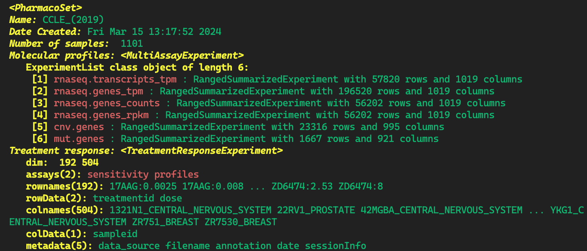
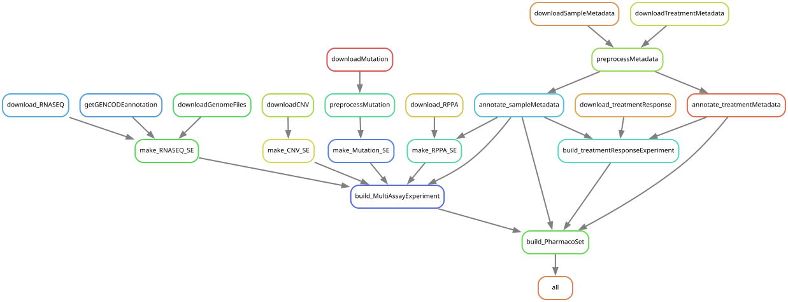
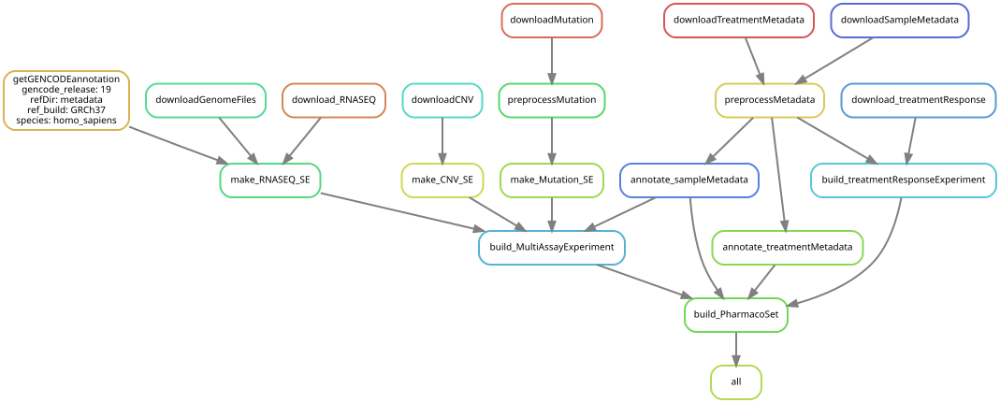
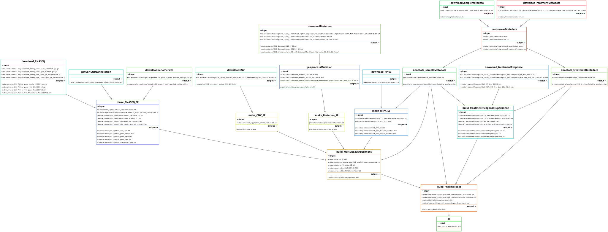

# This is the repository for the CCLE pipeline

This pipeline is considered `End-to-End` and will take you from downloading the raw data needed to a fully annotated dataset.

## STATUS REPORT



## Requirements & Setup

- [Snakemake](https://snakemake.readthedocs.io/en/stable/)

### Using Conda

> !NOTE: This repo no longer uses conda in favor of `pixi` for package management. The conda environment file is still available for reference but not guaranteed to be up-to-date.

Ensure you have conda installed. If not, install [miniconda](https://docs.conda.io/en/latest/miniconda.html).
Install mamba for faster package management:

``` bash
conda install mamba -n base -c conda-forge 
```

``` bash
mamba env create -f workflow/envs/pipeline.yaml
conda activate ccle_snakemake
snakemake --version
```

### Using Pixi

```bash
pixi install
```

This makes sure that the lock is synchronized and version controlled.

```bash
pixi run snakemake --dryrun
```

### Apple Silicon local development

On `osx-arm64`, use the Pixi environment directly and install the R package
stack once:

```bash
pixi install
pixi run setup
```

The setup script installs the same BHKLab package layer used by the Conda
post-deploy hooks. Set `COREGX_REF`, `PHARMACOGX_REF`, or `ANNOTATIONGX_REF`
before running `pixi run setup` to pin a specific branch, tag, or commit.

Use the macOS profile for local dry-runs and development runs. This profile does
not enable Conda or Singularity, so rules run against the active Pixi R
environment.

```bash
pixi run dryrun-osx
pixi run pipeline-osx
```

DepMap currently serves a browser verification page for a few portal downloads.
If those requests fail, download the files manually from DepMap and place them at
the expected pipeline paths before rerunning:

- `rawdata/cnv/OmicsCNGeneWGS.csv`
- `rawdata/cnv/OmicsCNSegmentsWGS.csv`
- `rawdata/mirna/CCLE_miRNA_MIMAT.csv`
- `rawdata/mutation/OmicsSomaticMutations.csv`

Treatment metadata annotation uses live PubChem, UniChem, and ChEMBL services.
For faster local development, skip optional external ID enrichment:

```bash
CCLE_SKIP_UNICHEM=1 CCLE_SKIP_CHEMBL=1 pixi run pipeline-osx
```

UniChem and ChEMBL lookups are time-limited by default. Override the per-request
limits with `CCLE_UNICHEM_TIMEOUT_SECONDS` and `CCLE_CHEMBL_TIMEOUT_SECONDS`.

### Enter into the environment

```bash
pixi shell

# Exit the environment using "exit"
```

## Running the pipeline

``` bash
snakemake --profile workflow/profiles/local --cores <NUMBER_OF_CORES>
```

``` bash
snakemake --profile workflow/profiles/labserver
```

``` bash
snakemake --profile workflow/profiles/gcp 
```

## So far, the following has been implemented

### Using pixi

Running a single pixi command will run all the below commands:

``` bash
pixi run graphs
```

### Rulegraph

``` bash
snakemake --rulegraph | dot -Tsvg > resources/rulegraph.svg
```



### Directed Acyclic Graph (DAG)

```  bash
snakemake -F --dag | dot -Tsvg > resources/dag.svg
```



### Filegraph

``` bash
snakemake --filegraph | dot -Tsvg > resources/filegraph.svg
```


