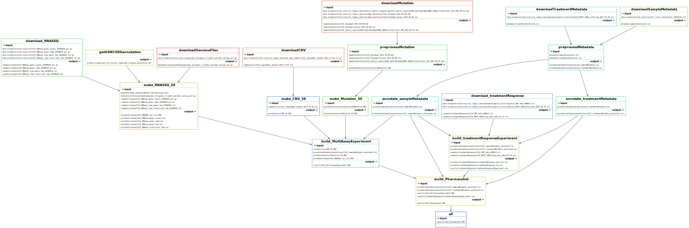

# This is the repository for the CCLE pipeline

This pipeline is considered `End-to-End` and will take you from downloading the raw data needed to a fully annotated dataset.

# STATUS REPORT


The pipeline report can also [be viewed here](https://storage.cloud.google.com/orcestradata/CCLE-Pharmacoset_Snakemake/report.html?authuser=1)

# Requirements
- [Snakemake](https://snakemake.readthedocs.io/en/stable/)


Ensure you have conda installed. If not, install [miniconda](https://docs.conda.io/en/latest/miniconda.html).
Install mamba for faster package management:

``` bash
conda install mamba -n base -c conda-forge 
```

``` bash
mamba create -n snakemake -c conda-forge -c bioconda snakemake=7.32.4
```

# So far, the following has been implemented:

## Rulegraph 
``` bash
snakemake --profile workflow/profiles/labserver --rulegraph | dot -Tsvg > resources/rulegraph.svg
```


## Directed Acyclic Graph (DAG)
```  bash
snakemake --profile workflow/profiles/labserver --dag | dot -Tsvg > resources/dag.svg
```


## Filegraph 
``` bash
snakemake --profile workflow/profiles/labserver  --filegraph | dot -Tsvg > resources/filegraph.svg
```


