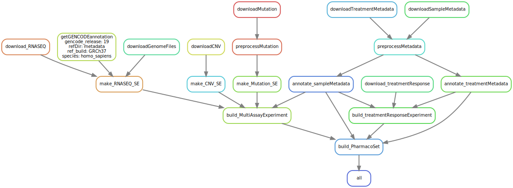

# This is the repository for the CCLE pipeline

This pipeline is considered `End-to-End` and will take you from downloading 
the raw data needed to a fully annotated dataset.


# Requirements
- [Snakemake](https://snakemake.readthedocs.io/en/stable/)


# So far, the following has been implemented:
Create using 
```bash
snakemake -s workflow/Snakefile -F --dag | dot -Tsvg \
> resources/dag.svg
```

## Rulegraph 
``` bash
snakemake --profile workflow/profiles/labserver --rulegraph | dot -Tsvg > resources/rulegraph.svg
```


## Directed Acyclic Graph (DAG)
```  bash
snakemake --profile workflow/profiles/labserver --dag | dot -Tsvg > resources/dag.svg
```



## Filegraph 
``` bash
snakemake --profile workflow/profiles/labserver  --filegraph | dot -Tsvg > resources/filegraph.svg
```


