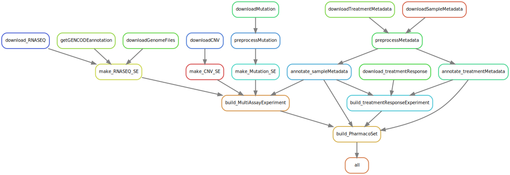

# This is the repository for the CCLE pipeline

This pipeline is considered `End-to-End` and will take you from downloading the raw data needed to a fully annotated dataset.

## STATUS REPORT


The pipeline report can also [be viewed here](https://storage.cloud.google.com/orcestradata/CCLE-Pharmacoset_Snakemake/report.html?authuser=1)

## Requirements & Setup

- [Snakemake](https://snakemake.readthedocs.io/en/stable/)


### Using Conda

> !NOTE: This repo no longer uses conda in favor of `pixi` for package management. The conda environment file is still available for reference but not guaranteed to be up-to-date.

Ensure you have conda installed. If not, install [miniconda](https://docs.conda.io/en/latest/miniconda.html).
Install mamba for faster package management:

``` bash
conda install mamba -n base -c conda-forge 
```

``` bash
mamba env create -f workflow/envs/pipeline.yaml
conda activate ccle_snakemake
snakemake --version
```

### Using Pixi


```bash
pixi install
```

This makes sure that the lock is synchronized and version controlled. 

## Usage

To add packages to the `default` environment:

```bash
pixi add pandas
```

### To run a command in the environment

```bash
pixi run snakemake --dryrun
```

### Enter into the environment

```bash
pixi shell

# Exit the environment using "exit"
```

## Running the pipeline

``` bash   
snakemake --profile workflow/profiles/local --cores <NUMBER_OF_CORES>
```

``` bash
snakemake --profile workflow/profiles/labserver
```

``` bash
snakemake --profile workflow/profiles/gcp 
```

## So far, the following has been implemented

### Rulegraph

``` bash
snakemake --rulegraph | dot -Tsvg > resources/rulegraph.svg
```



### Directed Acyclic Graph (DAG)

```  bash
snakemake -F --dag | dot -Tsvg > resources/dag.svg
```


### Filegraph

``` bash
snakemake --filegraph | dot -Tsvg > resources/filegraph.svg
```


